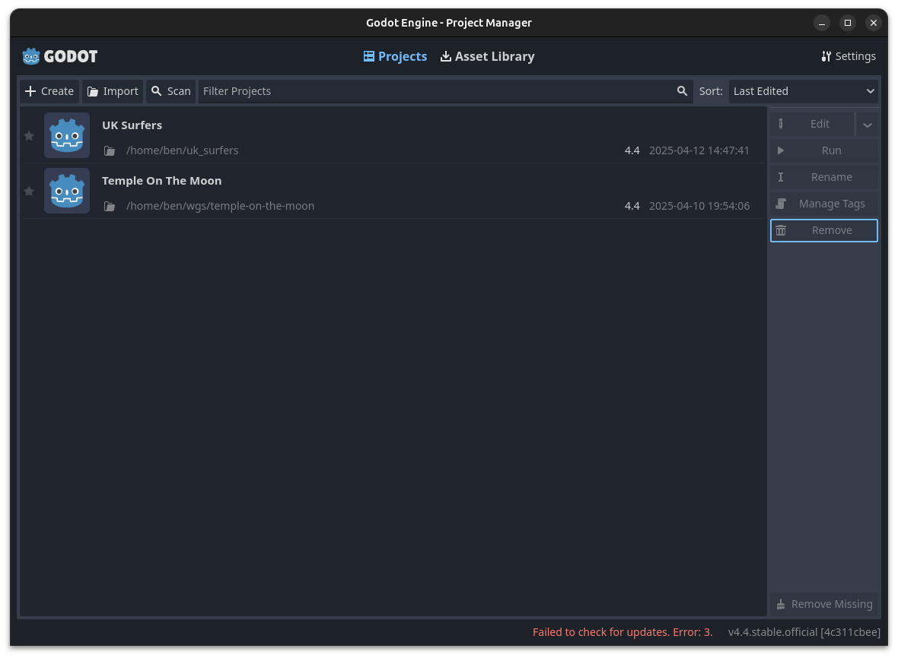
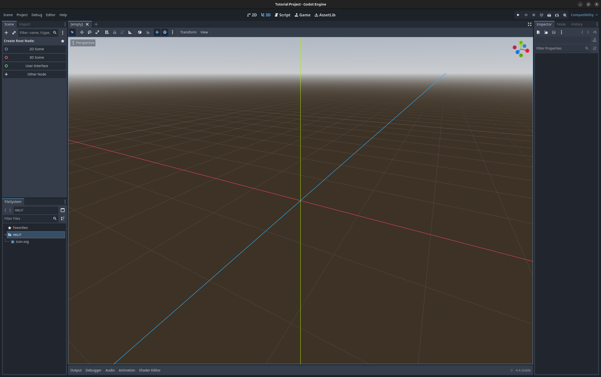
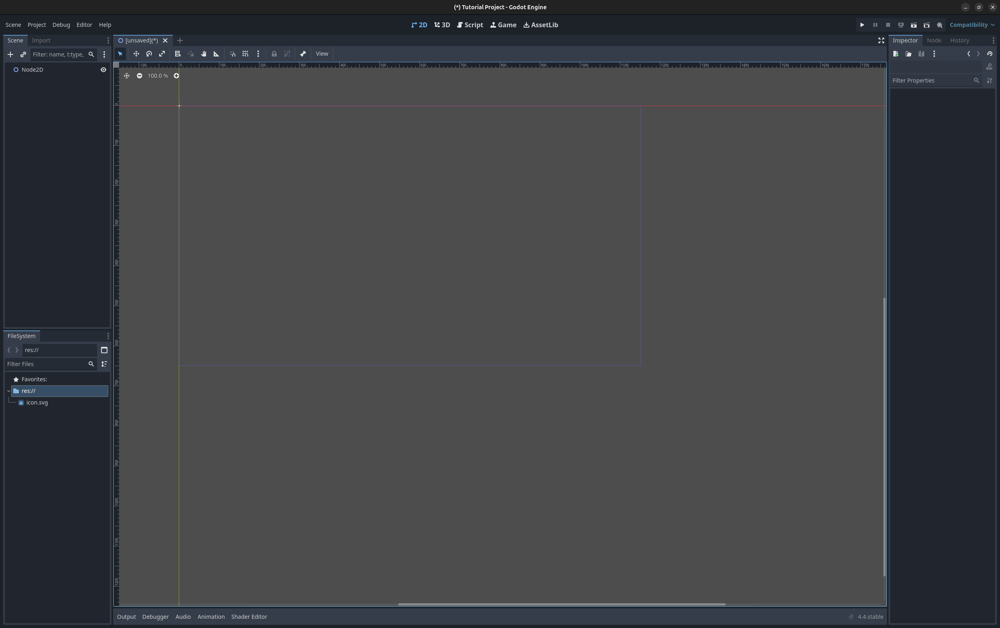
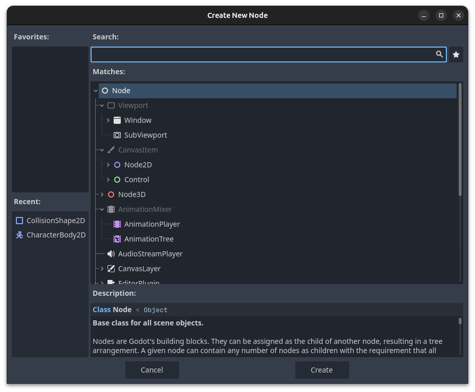
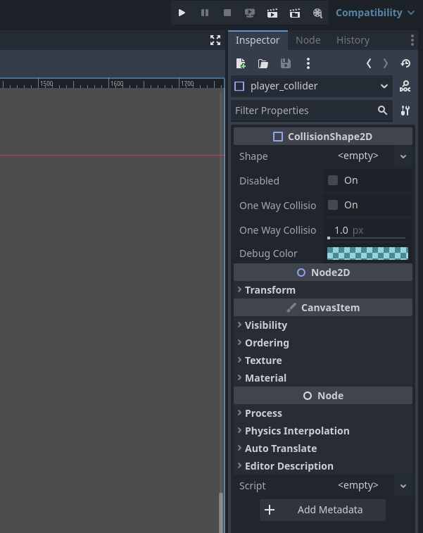
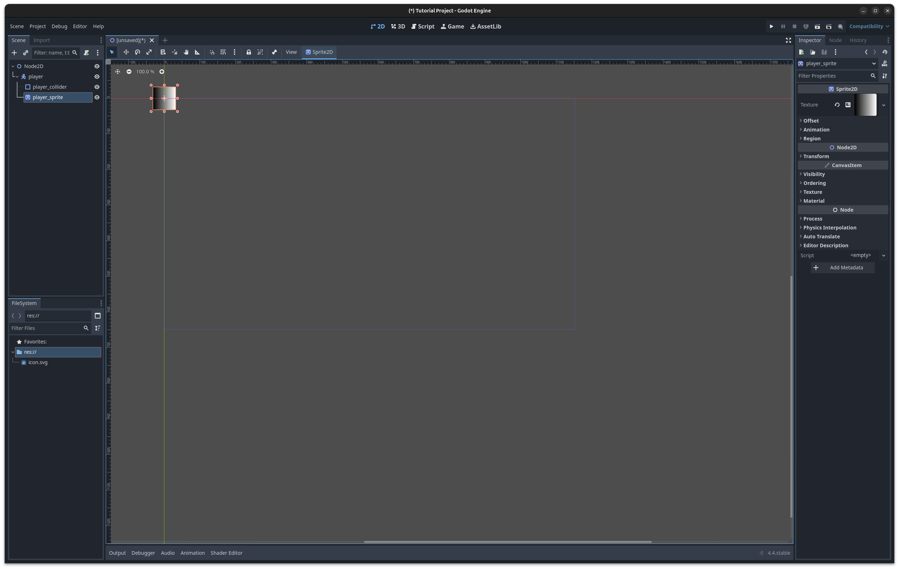
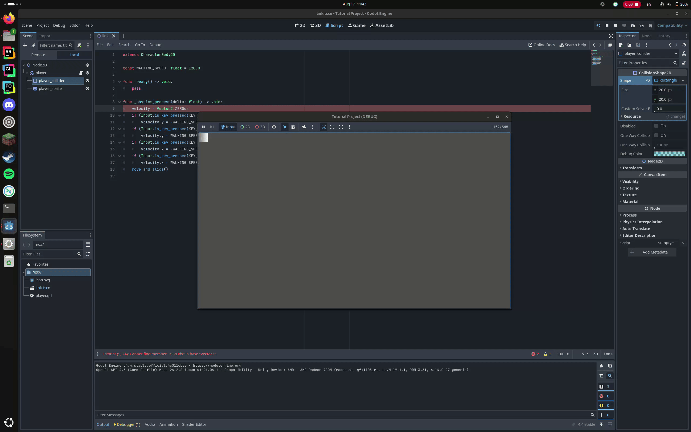

# Chapter 2: Godot Beginnings
Us programmers have the important role of creating Game Objects, or "toys", for
the game designers to play with. In this tutorial we will make a simple toy and
demonstrate how to play with it in the Godot editor.

If you'd rather follow along a video, watch
[this](https://youtu.be/LOhfqjmasi0?si=9OEUZUkWWFVwaBG2) as an alternative to
reading the following document. The content contained within will be used for
the next module as well. You can then skip to Part 2.4 for the assignment to
turn in.

If you haven't already installed Godot, you can do that
[here](https://godotengine.org/download/windows/).

## 2.1: Creating a Godot Project

Opening Godot, you're greated with something like this:



Click "+ Create" in the top left corner. This opens a popup window with some
basic project configuration. Don't worry about any options other than the name
and the location to save your project (that is, if you know what you're doing
go ahead and set the graphics settings to your liking), but make sure that the
"Version Control Metadata" option is set to "Git". We need this for Godot to
automatically generate git metadata files (the equivalent of running `git init
.` as seen in [Chapter 1](./chapter_1.md)).

You're now greeted with an empty 3D scene like this:



What's nice about Godot is that it's less cluttered than a larger, proprietary
editor. Nonetheless, there is much to parse here.

Now is a good time to describe the basic object of Godot: the Node.

## 2.2: The Node

A node in Godot is an object that has up to one parent and can have many
children. All nodes live in a scene, which is an environment where the editor
and runtime update the nodes it contains. There exists at any time exactly one
"root node", which is the only node in the scene that does not have a parent.
Therefore:

- A scene is a tree of nodes.
- A node is an element of the "scene tree" that has attached properties.
- These properties are user-defined and based on the "type" of the node.
- With some caveats, any node can be a child or parent of any other node.

Nodes are used to separate components of an object's logic into units. For
example, a playable character might have the following nodes:

- A `CharacterBody2D`, something that's updated by the physics engine and
  optimized for "player-like" movements.
  - A `CollisionShape2D`, the child of the `CharacterBody2D`, which gives it a
    collision shape.
  - An `AnimatedSprite2D`, which is a node that gets rendered as a sequence of
    sprite textures.
  - A `RayCast2D`, which lets programmers detect when another in-game object is
    "colliding" with some field of view of the sprite.

Example sprites we'll make may have more nodes than this. One can also define
custom node types, which we'll cover more in [Chapter 3](./chapter_3.md) about
advanced scenes and signals.

## 2.3: Creating a Scene

The first scene we'll create will be modeled after Link from the original The
Legend of Zelda.

Click on "2D Scene" in the left menu bar. You're then greeted by this:



The top portion of the left menu bar, named "Scene", shows a tree view of the
root node and all its descendants. We will refer to this portion as the "scene
tee" or the "tree view". The bottom portion, named "FileSystem", shows the
files (scene files, resources, assets, extensions, etc.) currently in the
project working directory. We will simply refer to this portion as the
"filesystem". Note that some hidden files are not shown immediately in the
editor, such as git metadata and some godot project files.

Start by clicking on the node in the scene tree and pressing `Ctrl+A` or
right-clicking on "Add Child Node...". You then see a popup like this:



Get used to this popup as you'll see it frequently. In the search bar look up
"CharacterBody2D" and select that type. Hit enter. Now select the node that
just appeared and press `F2` or right-click on "Rename" and give it the name
"player".

Now click on the "player" node in the scene tree and press `Ctrl+A` or
right-click on "Add Child Node..." again. This time, create a
`CollisionShape2D` and rename it to "player\_collider".

In the right menu bar of the editor lives a few submenus. The one currently
visible, named "Inspector", holds a bunch of data about the currently selected
node. As we're currently on "player\_collider", we'll see this:



These parameters control many aspects of the node itself from its transform,
texture, render properties, etc. Here, click on the box that says "\<empty\>"
and select "New RectangleShape2D". You now see in the 2D editor a small
square box. This is the collider we just created. Notice how you can resize it
to your heart's desire. If you'd like finer control, click on the rectangle in
the inspector that now says "RectangleShape2D". A submenu should appear with
some parameters.

Now click the "player" node in the scene tree and add a child node. Search for
"Sprite2D" in the node create menu and select it. Rename it to
"player\_sprite". Then navigate to the inspector and click on the box that says
"\<empty\>" as before. This time, click on the "New GradientTexture2D" option.
You now see seomthing like this:



This is a temporary texture we'll use for debugging. Later, we'll replace this
with an animated sprite that has changing textures in response to user input.
At this point we can save our progress using `Ctrl+S` or by navigating to
"Scene-\>Save Scene" in the top menu bar. Let's call it "link.tscn". You now
see the file in your filesystem in the bottom-left panel.

Now let's breathe life into the node. Right-click on the "player" node and
select "Attach Script...", then hit "Create". You now see a text editor instead
of the scene editor. To navigate between the two, use the menu items "2D" and
"Script" in the top-middle of the editor. Now paste this code into the editor:
```go
extends CharacterBody2D

const WALKING_SPEED: float = 120.0

func _ready() -> void:
	pass

func _physics_process(delta: float) -> void:
	velocity = Vector2.ZERO
	if (Input.is_key_pressed(KEY_W)):
		velocity.y = -WALKING_SPEED
	if (Input.is_key_pressed(KEY_S)):
		velocity.y = WALKING_SPEED
	if (Input.is_key_pressed(KEY_A)):
		velocity.x = -WALKING_SPEED
	if (Input.is_key_pressed(KEY_D)):
		velocity.x = WALKING_SPEED
	move_and_slide()
```

Let's break down what's going on here.

## 2.4: Anatomy of a Godot Script

```
extends CharacterBody2D
```
At the top of the file is an `extends` keyword. This declares to the script
what kind of node it should operate on. Extending a `CharacterBody2D` gives the
script writer access to properties only used by a `CharacterBody2D`, such as
velocity. Note that `CharacterBody2D` is called a "class". `Node`, `Node2D`,
`CollisionShape2D`, etc. are all class names.

```
const WALKING_SPEED: float = 120.0
```
We then define a constant value with `const`. This value won't change
throughout the duration of the game's lifetime. Its type is a `float` with the
compile-time value of `120.0`.

```
func _ready() -> void:
    pass
```
Every `CharacterBody2D` (and every node used by the editor) extends the `Node`
class. Therefore, our script also inherits the `Node` class and all its
properties and functions. We can change the behavior of the functions in the
"parent" class by writing out the function again. This is known as
"overloading" the function. Here we overload the `_ready` function, which the
engine calls only once when the node is instantiated.

` -> void:` states that the function doesn't return anything. Because GDScript
is a white-space scoped language (much like Python), we can't have a totally
empty function body, so we write `pass` to signify the function does nothing.

```
func _physics_process(delta: float) -> void:
	velocity = Vector2.ZERO
	if (Input.is_key_pressed(KEY_W)):
		velocity.y = -WALKING_SPEED
	if (Input.is_key_pressed(KEY_S)):
		velocity.y = WALKING_SPEED
	if (Input.is_key_pressed(KEY_A)):
		velocity.x = -WALKING_SPEED
	if (Input.is_key_pressed(KEY_D)):
		velocity.x = WALKING_SPEED
	move_and_slide()
```
This function has a more complex body than the previous one. It's called on
every frame that the physics engine updates. This is different from `_process`,
which updates every frame regardless if physics was updated or not. Here we
reset `velocity` to the zero vector. `velocity` is a property given to us by
`CharacterBody2D`; we didn't have to define it somewhere in the engine because
we inherited it using `extends`. We then update the components of velocity
depending on which of the WSAD keys were being pressed. Finally, the call to
`move_and_slide()` updates the player's current position depending on its
velocity.

To run, press `F5` or click the play button in the top-right corner of the
editor and use WSAD to move. You now have a primitive but playable character!



## 2.5: Next Steps:

The next tutorial will have you creating a 2D platformer. To complete this
module, create a new node that's controlled by the arrow keys on your keyboard.
The simplest way to do this would be duplicating the node we just created while
only changing the script we made. Then, change the behavior of the new player
somehow (maybe it could speed up the longer you hold the movement down, or it
could gradually accelerate instead of immediately moving and then stop
accelerating once a target speed is hit.) Whatever you do, explain its behavior
somewhere in your submission.

The preferred method for submitting this project would be creating a git
repository for what you create (or reusing an old one) and hosting it on
github. You can then send the Programming director the link to the github page.
Using Github would allow for pull requests and issues which would optimize
feedback. Alternatively, you can email the current Programming director a zip
file containing your project. You can find the email for the current director
in the [home page](./index.md).

